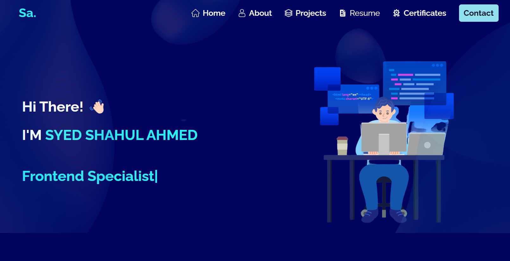

# 🚀 Personal Portfolio

# 


Welcome to my personal portfolio repository! 🎉 This is where I showcase my skills, projects, and accomplishments in web development, data science, and more. Take a look around to see what I’ve been working on!

## 🌟 Highlights
- **Responsive Design**: Optimized for all devices.
- **Interactive Projects**: Explore my work in Web Development, Data Science, and JavaScript/React Projects.
- **Elegant UI/UX**: Built using modern design principles.

## 🛠️ Technologies Used
- **Frontend**: React.js, Tailwind CSS, HTML, JavaScript


## 💡 Features
- 🖥️ **Showcase of Projects**: Explore my journey through my work.
- 📞 **Contact Me**: Links to connect and collaborate.

## 🚧 Installation
1. Clone the repository:
   ```bash
   git clone https://github.com/SyedShahulAhmed/Portfolio.git
   ```
2. Navigate to the project directory:
   ```bash
   cd portfolio
   ```
3. Install dependencies:
   ```bash
   npm install
   ```
4. Start the development server:
   ```bash
   npm run dev
   ```

## 🌐 Live Demo  
👉 Check out the live version: [MyPortfolio](https://shahul.vercel.app/)


## ❤️ Built With Love
This portfolio was crafted with care, creativity, and passion to reflect my professional journey.

<p style="text-align: center; font-size: 30px;
font-weight:600 ">⭐<i>Star this repo if you like it!</i></p>

